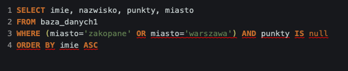
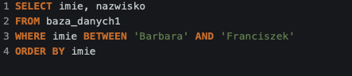
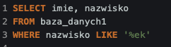

<!-- Breadcrumb Navigation -->
[🏠 Home](../../README.md) / [📂 SQL Learning](../README.md) / **📊 Lesson 2**

[📄 View Raw SQL Script](./Lesson-02-queries.sql)

---

# 📊 Lesson 2: Advanced Filtering, Sorting & Aggregations

Deep dive into data manipulation and analytical queries. I focused on organizing results and calculating metrics directly in SQL.

🛠️ What I learned:

- **Sorting & Uniqueness:** 
    - `ORDER BY` (ASC/DESC) – organizing data flow.
    - `DISTINCT` – extracting unique values from columns.
- **Advanced Filtering:** 
    - Logical operators: `AND`, `OR`, `NOT`.
    - Range & Set: `BETWEEN` (inclusive ranges), `IN` (checking against a list).
    - Pattern Matching: `LIKE` with wildcards (`%`, `_`).
- **Data Aggregation:** 
    - Functions: `SUM()`, `AVG()`, `COUNT()`, `MIN()`, `MAX()`.
    - Formatting: `ROUND()` for cleaner numerical outputs.
    - Group Filtering: `HAVING` – filtering results after aggregation.

📸 Step-by-Step Implementation:

  
<b>Click to expand screenshots (6 files)</b>

  #### 1. Sorting & Unique Values
  Using `ORDER BY` and `DISTINCT` to clean up the output.
  

    
  

  ---

  #### 2. Logical Filtering (AND, OR, IS)
  Combining multiple conditions for precise data extraction.
  

    
  

  ---

  #### 3. Range & List Selection (BETWEEN, AND)
  Efficiently selecting records within specific bounds or sets.
  

    
  

  ---

  #### 4. Pattern Matching (LIKE)
  Searching for specific string patterns using wildcards.
  

    
  

  ---

  #### 5. Basic Aggregations (COUNT)
  Calculating key metrics from the dataset.
  

    
  

  ---

  #### 6. Group Filtering and Aggregations (AVG, HAVING, AS)
  Applying conditions to aggregated data groups.
  

    
  

---
Task Status: ✅ Completed
